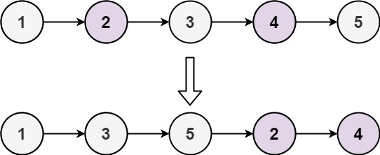

## 0328. [Odd Even Linked List](https://leetcode.com/problems/odd-even-linked-list/)

Given the `head` of a singly linked list, group all the nodes with odd indices together followed by the nodes with even indices, and return the reordered list.

The **first** node is considered **odd**, and the **second** node is **even**, and so on.

Note that the relative order inside both the even and odd groups should remain as it was in the input.

You must solve the problem in `O(1)` extra space complexity and `O(n)` time complexity.

#### **Example 1:**

<pre><code><strong>Input:</strong> head = [1,2,3,4,5]
<strong>Output:</strong> [1,3,5,2,4]</code></pre>

#### **Example 2:**

<pre><code><strong>Input:</strong> head = [2,1,3,5,6,4,7]
<strong>Output:</strong> [2,3,6,7,1,5,4]</code></pre>

#### **Constraints:**

- `n == number` of nodes in the linked list
- `0 <= n <= 104`
- `-106 <= Node.val <= 106`
